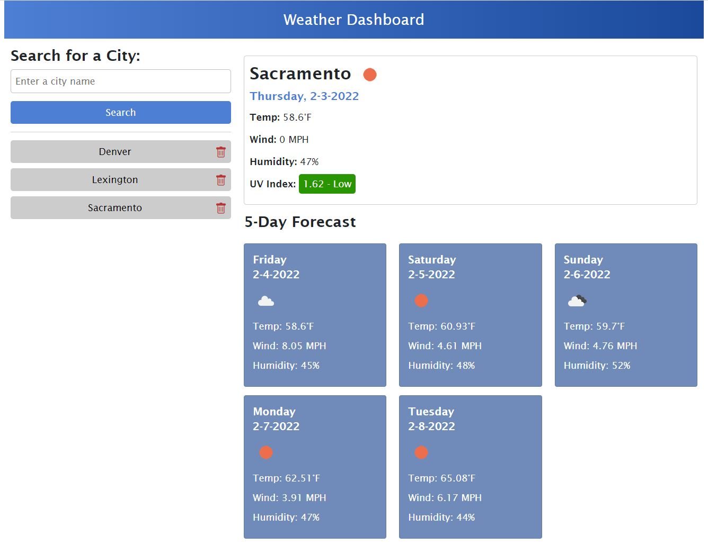
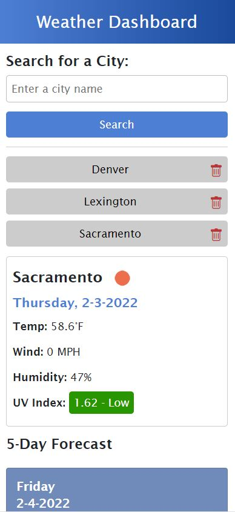

# Weather Dashboard

## Description
This weather dashboard allows an end user to view the weeather for a given city by entering a city name in the search area. It pulls up weather data for the current day, as well as a 5 day forecast. It stores your search history so you can easily find weather data for your favorite cities. You can also delete the cities you no longer need weather data for.

This project was a great oppurtunity to practice utilizing server-side APIs to pull data in from a remote location. This particular application utilized two API endpoints in order for the search by city functionality to work.

## Usage
Visit the live site at the following URL: 
<a href="https://jonmooney.github.io/weather-dashboard" title="CTRL+Click to open in a new window">https://jonmooney.github.io/weather-dashboard/</a> 

- Use the search box to search for city names. You may click 'Search' or press 'Enter'
- Once you search for a city, you'll see today's weather and a 5 day forecast on the right
- Search history will appear on the left, and the application allows you to delete items you no longer need
- The UV Index color follows the offical index data from the EPA

### Screenshot: Main layout

### Screenshot: Mobile Layout

## Features
- HTML
- CSS
- CSS Framework (Bootstrap)
- JavaScript (functions, events, DOM manipulation, fetch API)
- Server-side API (Open Weather)
- GitHub / Command Line

## Credits
Project idea by UC Davis Coding Bootcamp. All coding by Jon Mooney
